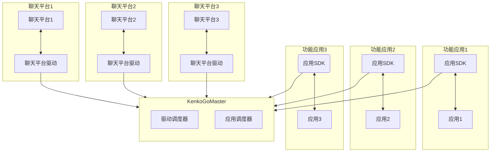

# TODO List 代办事项列表

- [ ] 使用 `Mermaid` 代替 `README.md` 中的二进制图片。

目前布局尚未实现 `README.md` 中的效果。

```mermaid
flowchart TD

    subgraph 聊天平台1
    C1[聊天平台1]<-->D1[聊天平台驱动]
    end
    subgraph 聊天平台2
    C2[聊天平台2]<-->D2[聊天平台驱动]
    end
    subgraph 聊天平台3
    C3[聊天平台3]<-->D3[聊天平台驱动]
    end

    subgraph 功能应用1
    S1[应用SDK]<-->A1[应用1]
    end
    subgraph 功能应用2
    S2[应用SDK]<-->A2[应用2]
    end
    subgraph 功能应用3
    S3(应用SDK)<-->A3[应用3]
    end

    D1 & D2 & D3-->M
    S1 & S2 & S3-->M

    subgraph M[KenkoGoMaster]
    direction TB
        DS[驱动调度器]
        AS[应用调度器]
    end
```
